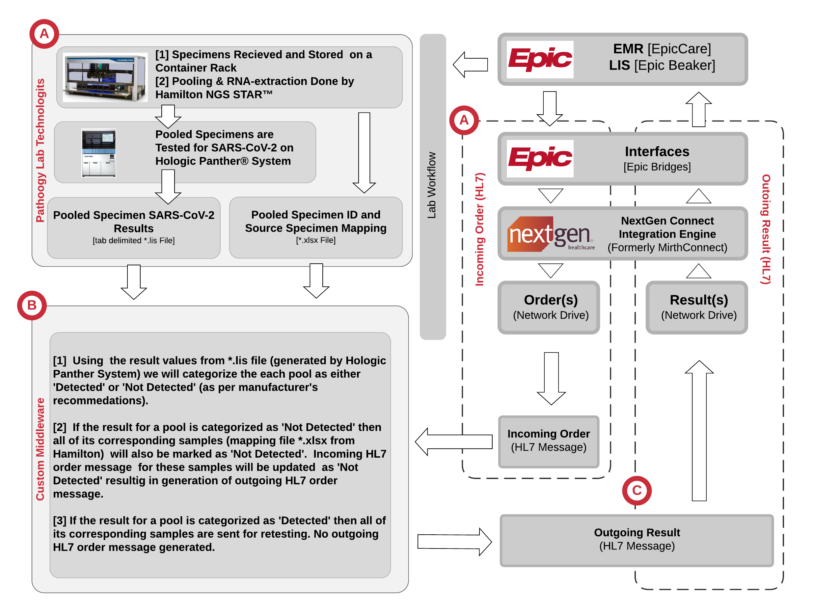

# README #
### What is this repository for? ###
* This project reads the sample to pool mapping file from Hamilton and pool results file from Panther System, analyzes the negative samples and results the negative resulted samples to EPIC.

### How is this approach benifited? ###
* With the rising in COVID-19 cases, the usage of test resources and time taken for the result is also increasing constantly. Here at the University of Florida, after analysing the number of 
  positive cases among the total number of tests conducted, we came up with this approach to effectively employ the test resources and reduce the turn around time for the results.
* Based on the analysis, we identified that, it is only around 3 or 4 cases tested positive out of 100 tests conducted. So, we decided to put multiple samples into a single pool and test the pool 
  instead of testing all the samples individually.
* For example, consider there are 100 samples to be tested. If we test each sample individually, that is going to take 100 tests and slow down the process. Instead, we form a pool with 5 samples.
  So, 20 pools are formed for the 100 samples and we test only these 20 pools. 
* If some of the pools are resulted positive, we test each sample in the pool individually. As the number of positive cases are less than 4% in total, we end up doing 40 tests at the maximum instead of 100.

### How are the results interpreted? ###
* After reading the pool results file from the Hologic Panther System, if a pool result is "valid"(column - Interpretation 2), "Negative"(column - Interpretation 3), and has its RLU Score less than 350
  (column - Interpretation 1), we categorize the pool result as Negative. The samples associated with this pool are also categorized "Negative" and these results are processed and uploaded to EPIC(EHR System).
* Otherwise, the pool is categorized as "Positive". The samples associated with this pool are tested individually and the results are processed and uploaded to EPIC. 

### What do I need to run this? ###
* python 3 or above installed.
* The input arguments needed are as follows:
	* -s <sample to pool mapping file> - path to an excel file(.xlsx) that contains the sample to pool mapping information.
	* -p <pool results file> - path to the results file which contains the result information of all the pools that are tested.
	* -o <mirth orders directory> - directory path for the HL7 incoming messages.
	* -r <mirth results directory> - directory path for the resulting HL7 messages.
	* -a <mirth archive directory> - directory path of the archives where ordered messages are moved after resulting it.

### What do the input files mean? ###
* Hamilton_NGS_STAR_TST_SAMPLE_POOL_MAP.xlsx
	* Gives us the mapping of each sample to a pool. Using this file, we interpret the results of each sample based on the pool result to which the sample is associated with.
		* Pooled Sample Barcode - The barcode ID of the pools.
		* Source Sample Barcode - The barcode ID of each samples.
* Hologic_Panther_System_TST_SAMPLE_POOL_RESULTS.lis
	* Gives the results of the pools that are tested for.
	* The columns from this file that we use are:
		* Specimen Barcode - The pool barcode ID. It is the same ID that is used in the Pool_Map file to map samples to a pool.
		* Interpretation1 - It contains the RLU Score. If the score is less than 350 and the result is valid, then the pool is categorized as "Negative".
		* Interpretation2 - If the value is "valid", it means the test has been conducted succesfully for this pool. Otherwise, it reports "Invalid".
		* Interpretation3 - This columns gives the actual result of the test for this pool. It gives either "Positive" or "Negative" if the pool is tested positve or negative correspondingly.

### What is the output? ###
* After interpreting all the pool results, an output excel file is generated with detailed information for all the samples.
* It starts with the sample ID, pool ID to which this sample is associated, result for the sample, and says if the sample results are uploaded to EPIC or not.
* If the pool is tested Negative, then all the associated samples' results are uploaded to EPIC. Otherwise, they are not uploaded at this time.

### How do I run this? ###

* Download the source code from the repository
* Generate the needed input files (refer the sample files in the repository).
* Note down the source paths for the mirth folders.
* Run the python script as below:
* python3 Pool_Covid19_Panther.py -s <sample_to_pool_mapping_file> -p<pool_results_file> -o<path_to_orders_dir> -r<path_to_results_dir> -a<path_to_archives_dir>
* Give python3 Pool_Covid19_Panther.py -h for help.

### Workflow ###

### Who do I talk to? ###

* Dr. Srikar Chamala
* Pathology Lab, University of Florida
